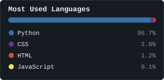

  

## 🌐 Connect
 &nbsp;&nbsp;&nbsp; 

## 🚀 Featured Projects
- 🤖 [Agentic-AI](https://github.com/Ranjith-13/Agentic-AI) - Three working Azure OpenAI agents: a bug-finder, a code-to-diagram converter, and an automated test-case generator.
- 📊 [Data-Visualization](https://github.com/Ranjith-13/Data-Visualization) - Tableau dashboards analyzing personal Goodreads reading habits and Netflix's movie/TV catalog.
- 🎧 [Spotify-Data-Analysis](https://github.com/Ranjith-13/Spotify-Data-Analysis) - Exploratory data analysis and visualization of Spotify track data with Pandas, NumPy, Matplotlib and Seaborn.
- 💬 [Chat-Sentiment-Analysis](https://github.com/Ranjith-13/Chat-Sentiment-Analysis) - Chat statistics and sentiment (positive/negative/neutral) classification on WhatsApp data.
- 🧚 [FairyTail](https://github.com/Ranjith-13/FairyTail) - A responsive, animated charity/volunteering landing page built with vanilla HTML, CSS and JavaScript.

## 📊 Stats
<table>
<tr>
<td>

</td>
<td>

</td>
</tr>
</table>
